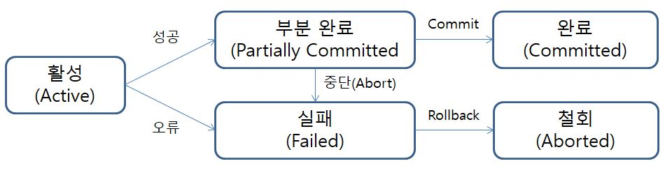

# **데이터 베이스**

참고 문헌: Database System Concepts 6th(
Abraham Silberschatz, Henry F.Korth, S. Sudarshan) 

---
## 목차
---
# 트랙잭션(Transaction)

 

## 트랜잭션이란? 

> 다양한 데이터 항목들을 엑세스하고 갱신하는 프로그램 수행의 __단위__

 

. . .트랜잭션은 __begin transaction__ 과 __end transaction__ 형태의 명령문으로 구분된다. 
하나의 트랙잭션은 이 __begin transaction__ 과 과 __end transaction__ 사이에서 실행되는 모든 연산들을 가리킨다. 

 

## 트랜잭션의 성질

 
ACID

- 원자성(atomicity)
    - 트랜잭션의 모든 연산들이 정상적으로 수행 완료되거나 아니면 전혀 어떠한 연산도 수행되지 않은 원래 상태가 되도록 해야한다. = 완료되지 않은 트랜잭션의 중간 상태를 DB에 반양해서는 안된다

   

- 일관성(consistency)
    - 고립 상태(동시에 수행되는 트랙잭션이 없는상태)에서의 트랜잭션 수행이 DB의 일관성을 보존해야 한다.  = DB는 항상 일관된 상태로 유지되어야한다.

     

- 고립성(isolation) 
    - 툴 이상의 트랜잭션이 동시 실행되고 있을 때, 어떤 트랜잭션도 다른 트랜잭션 연산에 끼어들 수 없다.  = 각각의 트랜잭션은 서로 간섭 없이 독립적으로 이루어져야한다.
    
     

- 지속성(durability)
    - 트랜잭션이 성공적으로 수행 완료되고 나면, 트랜잭션에 의해 DB에 변경된 내용은 시스템에 오류가 발생한다 하더라도 지속되어야한다.

 

## 트랜잭션의 상태

 

</img>  

- 동작 : 초기 상태로, 트랜잭션이 실행 중이면 동작 상태에 있다고 말할 수 있다.
 

- 부분 커밋 : 마지막 명령문이 실행된 후의 상태를 말한다.
- 실패 : 정상적인 실행이 더 이상 진행될 수 없을 때 가지는 상태이다.
- 중단 : 트랜잭션이 롤백되고 데이터베이스가 트랜잭션 시작 전 상태로 환원되고 난 후의 상태이다.
- 커밋 : 트랜잭션이 성공적으로 완료된 후의 상태이다.

 

. . . 트랜잭션이 더 이상 정상적인 실행을 진행할 수 없다고 DB 시스템이 결정하면 트랜잭션은 실패 상태로 들어가게 된다. 
그러한 트랜잭션은 반드시 롤백되어야한다. 그런 다음 중단 상태로 들어가는데, 이 시점에서 시스템은 두 가지 선택사항을 가진다.
 

- 트랜잭션을 __재시작__ 할 수 있다. 재시작된 트랜잭션은 새로운 트랜잭션으로 간주된다.
- 트랜잭션을 __강제 종료__ 시킬 수 있다.

 

## 동시성 제어
 

> 트랜잭션 처리 시스템은 보통 여러 트랜잭션들이 동시에 수행되는 것을 허용한다. 
여러 트랜잭션들이 동시에 데이터를 갱신함에 따라 데이터의 일관성과 관련된 여러 가지 복잡한 문제들이 생긴다. 
트랜잭션들의 동시성과 일관성을 모두 보장하기 위해서는 추가적인 노력이 필요하다. 트랜잭션들이 한번에 하나씩 순차적으로 실행되도록 하면 문제는 훨씬간단해진다. 
__하지만 동시성을 허용함으로써 두 가지 이점을 얻을 수 있다.__
 
- 처리율과 자원 이용률 향상
    - 동시성을 허용할 경우 프로세서와 디스크가 정지해있는 휴식시간을 줄일수 있다. 
      하나의 트랜잭션은 많은 단계들로 구성되어있다. 이들중 어떤 것들은 I/O 처리를, 다른 것들은 CPU를 요청할 수 있다. 
      CPU와 I/O 시스템의 병렬성은 여러 트랜잭션들이 동시에 실행할 수 있도록 한다. 
      이를 통해 시스템의 __처리율__ 과 프로세서와 디스크의 __이용률__ 을 높인다.

     

- 대기 시간 감소
    - 동시 수행은 실행중인 트랜잭션의 예기치 않은 지연을 줄일 수 있으며 __평균 응답 시간__, 즉 트랜잭션이 요청된 후에 완료될 때 까지 걸리는 평균 시간을 줄일 수 있다.

 

DB에서 동시 수행을 적용하는 동기는 본질적으로 OS에서 __다중 프로그래밍(Multi Programming)__ 을 사용하는 것과 같다.

동시성 제어 컴포넌트
트랜잭션 격리 수준

 

---

