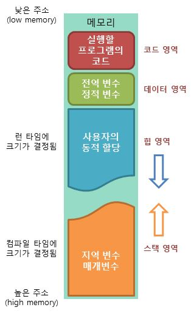

# **운영체제**

참고 문헌: Operating System Concepts(
Abraham Silberschatz , Peter B. Galvin , Greg Gagne) 
참고 강의: KOCW 양희재 교수님 운영체제 강의

---

목차 

- [운영체제란?](#운영체제란?)

- <a href = "#2">운영체제 서론</a>

- [운영체제 역사](#운영체제-역사)
- [인터럽트](#Interrupt(인터럽트))
- [이중모드](#Dual-Mode(이중모드))
- [운영체제 서비스](#운영체제-서비스)
- [시스템 콜](#시스템-콜(System-call))
- [프로세스](#프로세스(Process))
- [스레드](#스레드(Thread))
- [PCB](#PCB(Process-Control-Block))
- [CPU Scheduling](#CPU-Scheduling)

---

# 운영체제란?

컴퓨터의 하드웨어를 관리하는 소프트웨어, 하드웨어와 소프트웨어 사이의 **인터페이스**이다.

</img>  

컴퓨터 시스템 자원들을 효율적으로 관리하여

- 성능을 높이고
- 사용자의 편의를 높여준다. 
  . . 컴퓨터 하드웨어를 관리하는 프로그램

</img> 

---

<h2 id = "2">운영체제 서론</h2>

 

**-Booting**
 

컴퓨터의 구조를 단순화하면 이러하다. 

</img> 

- Processor: 일반적인 CPU
- ROM: 비휘발성, 전원이 꺼져도 내용이 유지된다. 보조메모리, 디스크
- RAM: 휘발성, 전원이 꺼지면 내용이 지워진다. 흔히 말하는 메인 메모리

컴퓨터의 전원을 키면 CPU에서 ROM에 있는 내용을 읽는다.
ROM에는 **POST**,**부트 로더** 가 저장되어 있다. POST는 전원이 켜지면 가장 처음에 실행되는 프로그램으로 컴퓨터의 상태를 검사한다.
그 다음 부트 로더가 실행된다. 부트 로더는 하드디스크에 저장되어 있는 운영체제를 찾아서 RAM 에 가지고 온다. 이러한 부트 로더의 과정을 부팅이라고 한다

---

**-Shell**

Command Interpreter

 

운영체제는 크게보면 커널(Kernel), 쉘(Shell) 로 구성된다.
 

</img> 

- 커널 : 실제로 관리하는 프로그램. 뜻 그대로 핵심
- 쉘 : 사용자의 명령을 화면에 보여주는 역할  
  쉘은 사용자가 요청하는 **_명령어를 해석하여 커널에 요청하고 결과를 화면에 보여준다._**
   
   

**-Application on OS** 

프로그램은 특정 운영체제에 맞춰서 만든다. 하나의 프로그램은 같은 CPU일지라도 다른 운영체제에서는 제대로 작동하지 않는다. 
실행 파일은 오직 동작하는 코드만 있는게 아니라 정적 혹은 동적으로 링크된 데이터, 링커의 정보와 라이브러리 참조 등의 정보가 담겨있다. 
Intel CPU의 예를 들면 Linux 의 C compiler는 gcc/gcc+ compiler 이고 최종 메모리에 로드 되어 실행되는 object file 형식은 ELF, Windows 의 C compiler는 Visual C++ compiler 이고 최종 메모리에 로드 되어 실행되는 object file 형식은 PE 이다. 
C Source Code 에서 CPU의 Machine Code로 변환되는 과정은 OS 종속적이게 된다. 
~~CPU가 다른 경우엔 __ISA(명령어 집합)__ 가 다르기 떄문에~~
 
 

</img> 

애플리케이션은 위의 그림과 같이 운영체제 위에서 수행한다. 즉, 하드웨어 자원을 직접적으로 사용하지 않고 운영체제가 **제공하는 자원**만을 사용할 수 있다. 
 

---

 

# 운영체제 역사

 

**-초기의 컴퓨터** 

초기 컴퓨터는 크게 3가지로 구성되었다. 카드 리더(입력), 프로세서(연산), 프린터(출력)이다.
  

**-Batch Processing System(일괄 처리 시스템)** 

-최초의 운영체제 

오퍼레이터에서 **컴파일-링크-로드**의 일련의 작업을 수행했는데, 이 업무를 **자동화**한 것이 **Batch Processing System(일괄 처리 시스템)**이다. 업무를 수행 하는 프로그램을 메모리안에 할당해주었다.
  

**-Multiprogramming System(다중 프로그래밍 시스템)** 

과거에 컴퓨터의 메모리에는 단 하나의 사용자 프로그램을 할당해서 사용했다.
프로그램이 실행될 때 **CPU 작업과 I/O 작업이 번갈아가며 동작**하는데 I/O 작업이 수행되는 동안 CPU가 일하지 않는 **_idle_** 상태가 된다. 
그리고 I/O 작업의 속도는 CPU와 비교했을 때 매우 느려서 idle 상태의 비율이 높았다.
이러한 비효율적인 루틴을 해결하기 위해 다중 프로그래밍이 나왔다.  
. . . A 라는 애플리케이션이 I/O 작업을 수행한다면, 그사이 CPU가 B라는 애플리케이션의 작업을 수행하여 CPU의 효율을 높이고자 하였다. 

. . . CPU 스케줄링, 메모리 관리, 보호 문제 등장

 

**-Time Sharing System(시분할 시스템)** 

시간이 지나 모니터와 키보드를 사용하면서 사용자와 컴퓨터 사이에 **대화 형식**이 가능해졌다.
컴퓨터가 너무 비쌌기 때문에 여러명이서 하나의 컴퓨터에 단말기(terminal)형태로 사용했다.

멀티프로그래밍에서는 한 사람이 CPU를 점유하고 있으면 다른 사용자는 CPU를 사용할 수 없다. 그러므로 다른 사용자들은 CPU를 점유 중인 프로그램이 I/O 작업으로 전환되기 전까지 사용할 수 없었고 이는 매우 비효율적이었다.

이에 CPU가 하나의 프로그램을 수행하는 **시간을 제한**하는, **time-sharing system** 이 등장했다. 일정 시간을 두어 프로그램들을 번갈아 수행하면서 모든 프로그램이 공평하게 수행이 했고, 이는 CPU가 하나인 환경에서도 여러 사용자가 동시에 사용하는 듯한 효과를 주었다. 
. . . 1960년대 UNIX 대표적인 시분할 시스템.  
</img>  

시분할 시스템을 사용하면서 여러 사용자(프로세스)간에 통신이 가능해졌다. 하지만 여기서도 역시 멀티프로그래밍에서와 같은 스케줄링과 메모리 문제가 있었다. 이를 해결하기 위해 동기화 기술, 가상 메모리 등이 이후에 나왔다. 

---

# Interrupt(인터럽트)

 

인터럽트는 CPU에게 보내는 전기 신호로서 인터럽트가 발생하면 CPU는 하던 일을 중지하고 해당 인터럽트를 처리하기 위해 운영체제 내부에 있는 **정해진 코드**를 수행한다. 그리고 수행이 끝나면 원래 위치로 돌아간다. 

. . .'정해진 코드'를 **인터럽트 서비스 루틴(ISR), 인터럽트 핸들러(Interrupt Handler)** 라고 한다.
  

인터럽트의 종류 3가지

- 하드웨어 인터럽트 
  . . . 가장 빈번하게 발생함. I/O 장치로 부터의 요청 등
    
- 소프트웨어 인터럽트 
  . . .운영체제의 서비스를 사용하기 위해 운영체제에 요청하는 작업. . . [System call](##system-call)
    
- 내부 인터럽트 
  . . .프로그램을 수행하는 도중에 발생하는 예외상황. Overflow 등
    

 

---

# Dual Mode(이중모드)

 

한 컴퓨터를 여러 사람이 사용한다.(ex) 서버 등) 
한 사람의 고의, 실수로 치명적인 영향을 줄 수 있다.

이를 방지하기 위해 사용자 프로그램은 **치명적인 명령**은 사용하지 못하도록 하였다.

. . . CPU가 동작하는 모드를 두 가지로 나눈다.

- User mode
- Kernel mode

 

</img> 

하드웨어/소프트웨어 인터럽트가 발생하면 관리자 모드로 작업을 수행하고 다시 사용자 모드로 바꿔준다.  
**컴퓨터 자원**에 직접 접근할 수 없다.
  

---

# 운영체제 서비스

 

### 프로세스 관리

 

프로세스 관리는 운영체제 기능 중 가장 중요한 기능 중 하나이다. 프로세스와 프로그램은 기본적으로 구분된다. 프로세스는 **실제 메인 메모리에서 실행 중인 프로그램**을 말한다.
 
 

- 프로세스의 생성과 소멸(creation, deletion)
- 프로세스 활동 일시 중지, 활동 재게(suspend, resume)
- 프로세스간 통신(IPC)
- 프로세스간 동기화(synchronization)
- 교착상태 처리(deadlock handling)

 

### 주기억장치 관리

 
주기억장치 즉, 메인 메모리는 프로그램이 실행되기 위한 공간이다. CPU는 오직 메인 메모리에 있는 프로그램(프로세스)하고만 소통할 수 있다. OS는 메인 메모리를 효율적으로 사용하도록 관리한다.
 
 

- 프로세스에게 메모리 공간 할당(allocation)
- 메모리의 어느 부분이 어느 프로세스에게 할당되었는가 추적 및 감시
- 프로세스 종료 시 메모리 회수(deallocation)
- 메모리의 효과적 사용
- 가상 메모리: 물리적 실제 메모리보다 큰 용량을 사용할 수 있다.

 

### 파일 관리

 

디스크는 물리적으로 Track과 sector로 구성되어 있으며, 여기서 파일이라는 논리적 관점으로 데이터를 바라보고 관리하는 것이다.
복잡한 과정으로 하드디스크에 저장되어 있는 것을 사용자가 편리하게 사용할 수 있도록 파일이라는 논리적 형태로 운영체제에서 관리하여 보여준다.
 
 

- 파일의 생성과 삭제(file creation, deletion)
- 디렉토리(Directory)의 생성과 삭제
- 기본 동작 지원: open, close, read, write, create, delete
- Track/sector - file 간의 매핑(mapping)
- 백업(Backup)

  

### 보조기억장치 관리

 

보조기억장치는 대표적으로 하드 디스크이다. 하드 디스크에서 아무 것도 저장되어 있지 않는 공간을 block이라 하는데, 보조기억장치 관리는 이를 관리하는 것이다.

- 빈 공간 관리(Free space management)
- 저장공간 할당(Storage allocation)
- 디스크 스케줄링(Disk scheduling)

  

### 입출력 장치 관리(I/O device management)

 

입출력 장치에는 키보드, 마우스, 프린터, 스피커, 마이크 등이 있다. 입출력 장치 관리는 이와 같은 여러 입출력 장치를 사용하기 위해 존재한다.

- 장치 드라이브(Device drivers)
- 입출력 장치의 성능향상: buffering, caching, spooling

  

# 시스템 콜(System call)
 

> 시스템에 내장 된 서브 루틴에 대한 호출

 

</img> 
 

- 운영체제의 커널이 제공하는 서비스에 대해, **응용 프로그램의 요청**에 따라 커널에 접근하기 위한 인터페이스이다.

 

### 시스템 콜과 함수 호출의 차이

- 시스템 콜 
컴퓨터에서 실행되는 프로그램에 운영 체제와 통신 할 수있는 인터페이스를 제공한다. 프로그램이 운영 체제의 커널에서 서비스 (자체 권한이없는 서비스)를 요청해야 할 때 시스템 콜을 사용. 
사용자 수준 프로세스에는 운영 체제와 직접 상호 작용하는 프로세스와 동일한 권한이 없다.  예를 들어, 외부 I / O 장치와 통신하거나 다른 프로세스와 상호 작용하기 위해 프로그램은 시스템 콜을 사용한다. 

- 함수 호출 
__서브 루틴 호출__ 이라고도 한다. 서브 루틴은 특정 작업을 수행하는 더 큰 프로그램의 일부이다. 더 큰 프로그램은 무거운 워크로드를 실행할 수 있으며 서브 루틴은 나머지 프로그램 코딩과는 독립적인 단순한 작업만 수행 할 수 있다. 함수는 여러 번 그리고 다른 위치 (다른 함수 내에서도)에서 호출 될 수있는 방식으로 코딩됩니다.  
함수가 호출되면 프로세서는 함수에 대한 코드가있는 곳으로 이동하여 함수의 명령을 하나씩 실행할 수 있다.  
기능을 완료 한 후 프로세서는 중단 된 위치로 정확히 돌아가서 다음 명령부터 실행을 계속한다.
  

> = 시스템 콜은 __시스템에 내장 된 서브 루틴에 대한 호출__ 이고 함수 호출은 __프로그램 내의 서브 루틴에 대한 호출__ 이다. 함수 호출과 달리 시스템 호출은 __프로그램이 권한이없는 일부 작업을 수행해야 할 때__ 사용된다.

 

### 시스템콜 유형 
- 프로세스 제어(중지, 실행, 프로세스 생성, 대기 메모리 할당 등등)
- 파일 조작(CRUD 등)
- 장치 조작
- 정보 유지보수
- 통신과 보호

---

# 프로세스(Process)

 

프로세스란? 
> 메인 메모리에 할당되어 __실행중인 상태__ 인 프로그램 

 
 프로그램은 일반적으로 하드디스크(보조기억장치)에 저장되어 아무 일도 하지 않는 상태이다. 
 프로세스는 실행하면서 stack pointer, data, text, register 등이 끊임없이 변한다.  프로세스는 job, task 등으로 불리기도 한다
  

 

### 프로세스 상태 

 

- New: 프로그램이 메인 메모리에 할당된다.
- Ready: 할당된 프로그램이 초기화와 같은 작업을 통해 실행되기 위한 모든 준비를 마친다.
- Running: CPU가 해당 프로세스를 실행한다.
- Waiting: 프로세스가 끝나지 않은 시점에서 I/O로 인해 CPU를 사용하지 않고 다른 작업을 한다. (해당 작업이 끝나면 다시 CPU에 의해 실행되기 위해 ready 상태로 돌아가야 한다.)
- Terminated: 프로세스가 완전히 종료된다. 
 
</img> 

 

---

 

## 프로세스의 메모리 영역 

 

</img> 
___출처: TCP school___
 

</img> 

 

- Code영역
  - 실행할 프로그램의 코드나 명령어들이 기계어 형태로 저장되는 영역이다. CPU는 코드영역에 저장된 명령어들을 하나씩 처리한다. 
   

- Data영역
  - 코드에서 선언한 __전역 변수와 정적 변수(static)__ 가 저장되는 영역이다. 프로그램이 실행되면서 할당되고 종료되면서 소멸된다. 
   

- Stack영역
  - 함수 안에서 선언된 지역변수, 매개변수, 리턴값등이 저장된다. 함수 호출시 기록되고 종료되면 제거된다. 
  - 스택 영역은 메모리의 높은 주소에서 낮은 주소의 방향으로 할당된다.
   

- Heap영역
  - 관리가 가능한 데이터 이외의 다른 형태의 데이터를 관리하기 위한 자유 공간(Free Space)이다.( 동적할당)
  - 메모리의 힙(heap) 영역은 사용자가 __직접 관리할 수 있는 '그리고 해야만 하는'__ 메모리 영역이다.
  - 힙 영역은 사용자에 의해 메모리 공간이 __동적으로__ 할당되고 해제됨

  - 힙 영역은 메모리의 낮은 주소에서 높은 주소의 방향으로 할당됨

 

---

# 스레드(Thread)

 

> 프로세스 내에서 실행되는 흐름의 단위

 

운영체제의 스케쥴러에 의해 독립적으로 관리될 수 있는 프로그래밍 된 명령어의 __가장 작은 시퀀스__ 이다.  
보통 하나의 프로그램은 하나 이상의 프로세스를 갖고 있으며 하나의 프로세스는 반드시 하나 이상의 스레드를 갖고 있다. 
프로세스를 생성하면 기본적으로 하나의 메인스레드가 생성된다. 
 

</img> 
 

프로세스는 실행될 때 운영체제로부터 각각 독립된 메모리 영역을 할당받는다.  
스레드는 프로세스 내에서 __고유한 자원(레지스터, 스택)만 별도로 할당받고 부모 프로세스의 Code, Data, Heap영역은 공유한다.__  
프로세스 내의 스레드들은 서로 주소공간이나 __자원을 공유__ 한다. 

 

> 스레드마다 고유한 자원(레지스터 집합, 스택)을 가지고 있는 이유는 __독립적인 함수 호출을 가능하게 하여 독립적인 실행 흐름을 추가하기 위해서__ 이다.

. . . <참고>  
pc(Program Counter) : 다음 실행될 명령어 주소를 가진 레지스터  
sp(Stack Pointer)   : 다음 스택을 쌓아야하는 위치주소를 가진 레지스터 
fp(Frame Pointer)   : 현재 함수가 끝난 뒤에 반환될 위치주소를 가진 레지스터 
 

> 스레드별로 main 함수를 독립적으로 가지고 있고, 함수 호출도 독립적으로 실행되기 때문에 __pc는 공유되지 않는다.__ 
> 그리고 독립적인 스택을 가지기 때문에 __sp, fp도 공유되지 않는다.__

 

---

# PCB(Process Control Block)

 
 
__프로세스에 대한 모든 정보__ 가 모여있는 곳으로, Task Control Block(TCB) 이라고도 한다. 
PCB안에는 프로세스의 상태, 프로세스 번호(PID), 해당 프로세스의 program counter(pc), register값, MMU정보, CPU점유 시간 등이 포함되어 있다. 
PCB는 운영체제 내부의 프로세스를 관리하는 코드 부분에 저장되어 있다.

 

</img> 
 

. . . __Context Switching__ 에 필요한 정보를 PCB에 저장한다.

 

### Context Switching
 

> 하나의 프로세스가 이미 CPU를 사용중인 상태에서 다른 프로세스가 CPU를 사용하기 위해 __이전 프로세스의 상태를 저장하고 새로운 프로세스의 상태를 적재하는 것__ 을 말한다. 

 

</img> 
 

CPU는 한 프로세스가 종료될 때까지 수행하는 것이 아니라 여러 프로세스를 중간 중간에 바꿔가면서 수행한다. 그러므로 CPU는 수행중인 프로세스를 나갈 때, 이 프로세스의 정보를 어딘가에 저장하고 있어야 다음에 이 프로세스를 수행할 때 이전에 수행한 그 다음부터 이어서 작업할 수 있다. 이러한 정보를 저장하는 곳이 PCB이다.
 
 

---

## 프로세스 큐
 
프로세스는 수행하면서 상태가 여러 번 변하는데 이에 따라 서비스를 받아야하는 곳이 다르다.  
그리고 프로세스는 일반적으로 여러 개가 한 번에 수행되므로 그에 따른 순서가 필요하다. 
이러한 순서를 대기하는 곳을 큐(queue)라고 부른다.

 

</img> 
 

- Job Queue: 하드디스크에 있는 프로그램이 실행되기 위해 메인 메모리의 할당 순서를 기다리는 큐이다.
- __Ready Queue__: CPU 점유 순서를 기다리는 큐이다.(스케줄링)
- __Waiting(Device) Queue__: I/O를 하기 위한 여러 장치가 있는데, 각 장치를 기다리는 큐가 각각 존재한다.

 

이외의 용어 
- CPU burst : 프로그램의 수행중에 연속적으로 CPU를 사용하는 단절된 구간 
  (스케줄링의 단위) 
- I/O burst : I/O를 요청한 다음 기다리는 시간 
. . . CPU burst가 큰 프로세스를 CPU bound process, I/O burst가 큰 프로세스를 I/O bound process 라 한다.
- Time quantum : time slice, 프로그램의 수행에 주어지는 시간, 시간 단위

 

---

 

# CPU Scheduling

> CPU가 하나의 프로세스 작업이 끝나면 다음 프로세스 작업을 수행해야 한다. 
> 이때 다음 프로세스가 어느 프로세스인지를 선택하는 알고리즘을 __CPU Scheduling__ 알고리즘이라고 한다.

 

### 선점 vs 비선점
 

- Preemptive(선점)은 프로세스가 CPU를 점유하고 있는 동안 I/O나 인터럽트가 발생한 것도 아니고 모든 작업을 끝내지도 않았는데, 다른 프로세스가 해당 __CPU를 강제로 점유__ 할 수 있다. 

 

- Non-preemptive(비선점)은 한 프로세스가 한 번 CPU를 점유했다면, __I/O 또는 프로세스가 종료__ 될 때까지 다른 프로세스가 CPU를 점유하지 못하는 것이다. 

 

선점 알고리즘 
- FCFS(First Come First Service) 
  - 들어오는 순서대로 처리된다.

   

- SJF(Shortest Job First) 
  - 실행시간이 짧은 프로세스에게 우선순위, 실행시간이 긴 프로세스는 기아 상태 문제점

   

- HRN(Highest Response-ratio Next) 
  - SJF의 단점을 보완하기 위해 생겼다. 
  - 우선순위 계산식을 이용하여 할당 
   
  </img> 
 

비선점 알고리즘 
- Round Robin 
  - 시분할 시스템을 위한 선점형 스케줄링 방식
  - 우선순위를 두지 않고, 순서대로 시간단위(Time Quantum)로 CPU를 할당하는 방식
  
   

- SRT(Shortest Remaining Time) 
  - SJF 스케줄링을 선점 형태로 수정한 방식
  - 현재 작업 중인 프로세스를 중단시키고 최단 잔여시간 프로세스의 처리를 시작하는 방식
    
   

- Multi Level Queue 
  - Ready Queue를 여러개로 분할
  - 각 큐는 독립적인 스케줄링 알고리즘을 가짐(ex. Foreground - RR, Background - FCFS)
  - 각 큐에 CPU time을 적절한 비율로 할당한다(ex. 80% for Foreground, 20% for Background) 
 
  </img> 
 

   

- Multi Level Feedback Queue 
  - MLQ와 다르게 프로세스가 다른 큐로 이동가능.
  - 처음 들어오는 프로세스는 무조건 맨 처음의 큐에 넣는다.
  - 주어진 time quantum 동안 작업을 못 끝낼시에 다음 큐로 이동시킴. 다음 큐에서도 반복
  - 이를 통해 CPU Burst 크기별로 구분된다. 
   
  </img> 
 

---

## 프로세스 동기화

 

---

## Critical section(임계구역)

 

---
