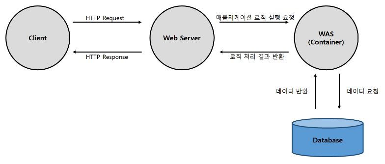

# **Web**

### #정리

---

## 웹이란 무엇인가?

 

- ### Network

  컴퓨터와 컴퓨터를 연결해 주는 망.  

- ### Internet
  통신 **프로토콜**을 이용해서 정보를 주고 받는 컴퓨터 네트워크 
  . . . 네트워크와 네트워크를 연결해 놓은 네트워크 

 

### Web?

 

World Wide Web의 줄임말로 WWW라고도 함. 
. . .서비스이다. 인터넷에서 제공하는 여러가지 서비스가 있는데, 그 중 가장 많이 사용하는 것이 바로 **웹 서비스**이다.
  

웹에서는 HTML 언어를 사용하여 작성된 하이퍼텍스트 문서를 웹 페이지(web page)라고 부르고, 이러한 웹 페이지들 중에서 서로 관련된 내용으로 작성된 웹 페이지들의 집합을 웹 사이트(web site)라고 한다.

웹은 이렇게 작성된 수많은 웹 페이지들이 하이퍼링크(hyperlink)를 통해 서로 연결되어 구성된다.

사용자가 웹 페이지에 포함된 하이퍼링크를 따라 다른 웹 페이지들로 계속하여 이동하는 것을 웹 서핑(web surfing)이라고 부르고, 이때 사용자가 웹 페이지를 검색하기 위해 사용하는 프로그램을 **웹 브라우저(web browser)** 라고 한다.
  

---

 

### Web Browser 와 Web Server

 
</img> 

 

웹 브라우저(Web Browser)는 인터넷을 활용하기 위해 사용하는 프로그램이다. 
HTML, CSS, 자바스크립트, 이미지, 폰트파일 등 **Rendering(렌더링)** 에 필요한 리소스를 서버에 요청하고 응답을 받아 화면을 구성한 뒤, 사용자에게 보여준다.

 

웹 서버(Web Server)는 HTTP를 통해 웹 브라우저에서 요청하는 HTML,CSS,JS 문서나 오브젝트(이미지 파일 등)을 전송해주는 서비스 프로그램이다.

 

---

## Web Browser

 

 ### Rendering(렌더링)  

 대부분의 브라우저는 렌더링을 수행하는 렌더링 엔진(Rendering Engine)을 가지고 있다. 
 렌더링이랑 HTML,CSS,JavaScript 등 개발자가 작성한 문서를 **브라우저에서 그래픽 형태로 출력하는 과정**을 말한다.   

 ### 렌더링 과정  

 **_. . .브라우저마다 차이가 있습니다._**  **_Google의 Web Fundamentals 문서를 참고하였습니다. https://developers.google.com/web/fundamentals?hl=ko_** 

  

 1. DOM(Document Object Model) 과 CSSOM(CSS Object Model) 생성

>     
>
> - ### DOM
>
>    
>  </img>
>  
>  
>
> - **변환** 
> : 브라우저가 HTML의 원시 바이트를 디스크나 네트워크에서 읽어와서, 해당 파일에 대해 지정된 인코딩(예: UTF-8)에 따라 개별 문자로 변환합니다.
>  
>
> - **토큰화** 
> : 브라우저가 문자열을 W3C HTML5 표준에 지정된 고유 토큰으로 변환합니다(예: '', '' 및 꺽쇠괄호로 묶인 기타 문자열). 각 토큰은 특별한 의미와 고유한 규칙을 가집니다.
>  
>
> - **렉싱** 
> : 방출된 토큰은 해당 속성 및 규칙을 정의하는 '객체'로 변환됩니다.
>  
>
> - **DOM 생성** : 마지막으로, HTML 마크업이 여러 태그(일부 태그는 다른 태그 안에 포함되어 있음) 간의 관계를 정의하기 때문에 생성된 객체는 트리 데이터 구조 내에 연결됩니다. 이 트리 데이터 구조에는 원래 마크업에 정의된 상위-하위 관계도 포합됩니다. 즉, HTML 객체는 body 객체의 상위이고, **_body_** 는 **_paragraph(p)_** 객체의 상위인 식입니다.  
>   
>
> **이 전체 프로세스의 최종 출력이 바로 이 간단한 페이지의 DOM(Document Object Model)이며, 브라우저는 이후 모든 페이지 처리에 이 DOM을 사용합니다.**  
>  
>
> - ### CSSOM  
>
>   </img>   
>    CSS 바이트가 문자로 변환된 후 차례로 토큰과 노드로 변환되고 마지막으로 'CSS Object Model'(CSSOM)이라는 트리 구조에 링크됩니다.
>      
>    </img> **_<DOM, CSSOM 구조도>_**  
>   서버로부터 받은 HTML, CSS를 다운로드 받아 연산과 관리가 유리하도록 Object Model을 생성한다.
>
>  
  

2. Render Tree 생성 
>     
>
> 1. DOM 트리의 루트에서 시작하여 표시되는 노드 각각을 트래버스합니다. 
>
>    > - 일부 노드는 표시되지 않으며(예: 스크립트 태그, 메타 태그 등), 렌더링된 출력에 반영되지 않으므로 생략됩니다. 
>    > - 일부 노드는 CSS를 통해 숨겨지며 렌더링 트리에서도 생략됩니다. 예를 들어,---위의 예시에서---span 노드의 경우 'display: none' 속성을 설정하는 명시적 규칙이 있기 때문에 렌더링 트리에서 누락됩니다. 
>
>  
>
> 2. 표시된 각 노드에 대해 적절하게 일치하는 CSSOM 규칙을 찾아 적용합니다.
> 3. 표시된 노드를 콘텐츠 및 계산된 스타일과 함께 내보냅니다.
>
>     
>
> </img> **_<렌더 트리 구조도>_** 
>
> DOM Tree 와 CSSOM Tree를 이용해서 Render Tree를 생성한다. 
> DOM Tree와 다르게 **스타일 정보** 가 설정되어 있다.
>  
> . . . **실제 화면에 표현되는 노드**들로만 구성되어있다. 
>  

  

3. 자바스크립트 파싱 
>   
>
> 자바스크립트의 파싱은 CSS파싱과 마찬가지로 렌더링 엔진이 HTML 문서를 한줄 씩 읽어나가다 **_script태그_** 를 만나면 **자바스크립트 엔진**에 제어권을 넘기며 시작됩니다. 
>
> 자바스크립트 엔진은 CPU가 이해할 수 있는 저수준 언어로 자바스크립트 코드를 파싱하고, 
> DOM, CSSOM과 같은 AST(Abstract Syntax Tree) 생성합니다. 
>
> . . . **AST: _토큰에 문법적 의미과 구조를 반영한 트리형태의 자료구조_** 
> 그리고 AST를 기반으로 바이트코드를 생성하여 인터프리터가 실행될 수 있도록 만듭니다.  
>
> </img>  

  

4. Layout 

> 생성된 Render Tree 노드들이 가지고 있는 스타일과 속성에 따라서 **브라우저 화면의 어느위치에 어느크기로 출력될지 계산하는 단계**이다. 
> 

 

5. Paint 

> 요소들을 실제 화면을 그리는 단계. 
> . . .Layout에서 요소들의 위치와 크기, 스타일 **계산이 완료된 Render Tree 를 이용해 실제 픽셀 값을 채워넣는다.**  
> 이 때 텍스트, 색, 이미지, 그림자 효과등이 모두 처리되어 그려진다. 
>  

 

 ### Reflow(Layout), Repaint(Paint) 

> 자바스크립트 코드가 실행되는 과정에서 DOM과 CSSOM을 변경하는 DOM API가 사용되면 변경된 DOM과 CSSOM이 다시 렌더트리로 결합되고 레이아웃과 페인트 과정을 거쳐 다시 렌더링됩니다. 
>
> 이 과정을 **리플로우(reflow), 리페인트(repaint)** 라고 합니다. 
>  

---

 

## Web Server

 

### Web Server(웹서버)
 

> 웹 브라우저와 같은 클라이언트로부터 
> HTTP 프로토콜로 요청을 받아, 
> HTML 문서 등과 같은 웹 페이지를 __정적__ 으로 처리해 반환하는 소프트웨어 
>
> 
>
>### 하드웨어/소프트웨어적 웹서버 
> 
>
>- 하드웨어 측면: 
>  - 웹사이트의 컴포넌트 파일들을 저장하는 컴퓨터 
>  - 컴포넌트 파일에는 html 문서/images/css stylesheets/JavaScript 파일 등 
>  - 이 컴포넌트 파일들을 최종 소비자의 디바이스에 전달함 
>  - 웹 서버는 인터넷에 연결되어 있고, 도메인 이름을 통해 접속될 수 있음 
> 
>- 소프트웨어 측면:
>  - 웹 사용자가 어떻게 호스트 파일들에 접근하는지를 관리 
>  - HTTP 서버는 URL(Web address)과 HTTP의 소프트웨어 일부 
> 
>
>### 기능 
> 
>- 정적인 컨텐츠 제공 
>- WAS를 거치지 않고 바로 자원 제공 
>- 동적인 컨텐츠 제공을 위한 요청 전달  
>
>
 

### Web Server(웹 어플리케이션 서버) 

> DB 조회나 다양한 로직 처리를 요구하는 동적인 컨텐츠를 제공하기 위해 만들어진 Application Server 
> HTTP 프로토콜을 통해 컴퓨터나 장치에 애플리케이션을 수행해주는 미들웨어 
> Web Server + Web Container(Servlet Contatiner) 
>>. . .Container란 JSP, Servlet을 실행시킬 수 있는 소프트웨어 
>> WAS는 JSP, Servlet 구동 환경을 제공한다.  
>### 기능 
>- 프로그램 실행 환경과 DB 접속 기능 제공 
>- 여러 개의 트랙잭션 관리 기능 
>- 업무를 처리하는 비즈니스 로직 수행  

 

</img>  

### WEB Server 와 WAS 분리 이유 
 

- __기능을 분리__ 하여 __서버의 부하를 방지__ 
  . . . WAS는 DB조회 등 페이지를 만들기 위한 다양한 로직을 처리하느라 바쁘다. 단순한 정적 콘텐츠를 WAS에서 제공한다면 다른 작업에 사용하는 리소스들로 인해 지연이 생겨날 수 있다. 그러므로 정적 콘텐츠는 Web Server선에서 빠르게 처리하는게 좋다.  
- 보안강화 
  - SSL(Secure Socket Layer)에 대한 암복호화 처리에 Web Server 사용.
  - 공격에 대해 Web Server을 앞단에 두어 중요한 정보가 담긴 WAS(DB나 로직)까지 전파되지 못하게 한다.
 

 

---

---
---

 

## SPA, MPA

> MPA : Multi Page Application, 한 개의 Page로 구성된 애플리케이션 
> SPA : Single Page Application 여러 개(Single) Page로 구성된 애플리케이션 
>
>  
>
> ___MPA___ 는 __새로운 페이지를 요청할 때마다 정적 리소스가 다운로드__ 된다. __매번 전체 페이지가 다시 렌더링 된다.__ 
> . . . MPA를 SSR(Server Side Rendering) 방식으로 렌더링 한다고 말한다. 
>  
> ___SPA___ 는 웹 에플리케이션에 필요한 모든 정적 리소스를 __최초 한 번__ 에 다운로드한다. 
> 그 이후 새로운 페이지 요청이 있을 때, 페이지 갱신에 __필요한 데이터__ 만 전달 받아서 페이지를 갱신한다. 
> . . . SPA를 CSR(Client Side Rendering) 방식으로 렌더링 한다고 말한다.
>
>  
> 
>   
>>    
>>  
>>  - ### MPA   
>>   
>>  </img>  
>>
>>  - 장점 
>>  1. __SEO__(Search Engine Optimization), 검색 엔진 최적화 관점에서 유리하다. 
>>   
>>  . . . MPA는 완성된 형태의 HTML 파일을 서버로부터 전달받는다. 
>>  따라서 검색엔진이 페이지를 크롤링하기에 적합하다. 
>>   
>>  2. 첫 로딩이 매우 짧다. 
>>   
>>  - 단점 
>>  1. 새로운 페이지를 요청할 때마다 전체 페이지를 렌더링한다. 
>>  2. 페이지 이동시 불필요한 템플릿도 중복해서 로딩 
>>  3. 서버 렌더링에 따른 부하 
>>    
>>
>>  - ### SPA  
>>   
>>  </img>  
>>
>>  - 장점 
>>  1. 필요한 부분만 갱신하기 때문에 네이티브 앱에 가까운 자연스러운 페이지 이동을 제공할 수 있다. 
>>  2. SPA는 최초 정적 리소스를 다운 받으면 데이터를 전부 저장해놓는다. 
>>    필요한 리소스만 부분적으로 로딩하기 때문에 성능면에서 좋다. 
>>  3. 서버의 템플릿 연산을 클라이언트로 분산하여 서버의 부하를 줄여준다. 
>>  4. 컴포넌트별로 개발하기 때문에 생산성이 증가된다. 
>>   
>>  - 단점 
>>  1. 초기 구동 속도가 느리다. 
>>  2. SEO 관점에서 불리하다. 
>>  3. 보안 문제 
>>  . . . SSR에서는 사용자에 대한 정보를 서버측에서 세션으로 관리를 하지만 CSR 방식에서는 클라이언트측의 쿠키말고는 사용자에 대한 정보를 저장할 공간이 마땅치 않다.
>>
>>  
>
> 

 

---

### HTTP? 
> 텍스트 기반의 통신 규약으로 __인터넷에서 데이터를 주고받을 수 있는 프로토콜__
 

클라이언트 즉, 사용자가 브라우저를 통해서 어떠한 서비스를 url을 통하거나 다른 것을 통해서 요청(request)을 하면 서버에서는 해당 요청사항에 맞는 결과를 찾아서 사용자에게 응답(response)하는 형태로 동작한다.
 
~~. . . HTML 문서만이 HTTP 통신을 위한 유일한 정보 문서는 아니다.~~  
~~JSON 및 XML과 같은 형태의 정보도 주고 받을 수 있다.~~ 
 
 
### HTTP 특징

> - HTTP 메시지는 HTTP 서버와 HTTP 클라이언트에 의해 해석이 된다. 
> - TCP/ IP를 이용하는 응용 프로토콜이다. 
> - HTTP는 연결 상태를 유지하지 않는 비연결성 프로토콜이다. __stateless__ 
    . . . 이러한 단점을 해결하기 위해 Cookie와 Session이 나옴. 
> - HTTP는 연결을 유지하지 않는 프로토콜이기 때문에 요청/응답 방식으로 동작한다. 

 

### Request
> 클라이언트가 서버에게 연락하는 것, 요청을 보낼때는 요청에 대한 정보를 담아 서버로 보낸다.

 

Request Method
- GET     : 자료를 __요청__
- POST    : 자료의 __생성__ 을 요청
- PUT     : 자료의 __수정__ 을 요청
- DELETE  : 자료의 __삭제__ 를 요청

 

### Response 
> 서버가 요청에 대한 답변을 클라이언트에게 보내는 것

 

상태 코드(Status Code) 
- 1XX(조건부 응답) : 요청을 받았으며 작업을 계속한다.
- 2XX(성공) : 클라이언트가 요청한 동작을 수신하여 성공적으로 처리했다.
- 3XX(리다이렉션 완료) : 클라이언트는 요청을 마치기 위해 추가 동작을 취해야 한다.
- 4XX(요청 오류) : 요청의 문법이 잘못되었거나 요청을 처리할 수 없다.(클라이언트 오류)
- 5XX(서버오류) : 서버가 유효한 요청을 수행하지 못했다.

 

---

## Servlet 
 

서블릿은 자바로 만들어진 프로그램을 서버에서 실행하기 위해 만들어졌다. 특히 웹 서비스 개발에 특화되어 있으며 데이터베이스 연동, 외부 서비스 연동을 통해 정적인 웹에 __동적인 정보 제공__ 을 가능하게 한다. 
 

## Why Servlet?

 

### CGI 
>Web Server는 이미 저장되어 있는 정적인 컨텐츠(Html)를 응답한다. 
>만약 사용자가 직접 정보를 찾거나(검색) 기록(저장)을 하려면 __웹서버의 문서를 직접 고치는 작업__ 이 필요했다.  
>때문에 사용자의 입력과 요청 url에 따라 __동적으로 변하는 페이지__ 가 필요하게 되었고, 
>웹서버에서 동적인 처리를 담당할 표준인 CGI(Common Gateway Interface)가 등장하게 되었다. 

 

. . . CGI는 __서버와 응용 프로그램간에 데이터를 주고받기 위한 방법이나 규약__ 을 뜻한다. 

>1. 웹 브라우저의 HTML의 폼을 통해 요청이 웹 서버로 전달 
>2. 웹 서버는 요청에 들어 있는 주소가 CGI 프로그램에 대응되는지 확인 
>3. 대응될 경우 그 프로그램을 실행, 환경 변수와 표준 입력의 형태로 요청을 전달한다. 
>4. 웹 서버는 CGI 프로그램이 표준 출력으로 돌려 보낸 내용을 그대로 응답으로 돌려 준다. 

 

CGI 의 가장 큰 단점은 __멀티프로세스 방식__ 이란 것이다. 멀티프로세스 방식은 요청이 올 때 마다 프로세스를 생성한다.  

. . .프로세스는 자원을 상당히 많이 차지하므로 이를 해결하기 위해 요청에 대응하여 프로세스가 아닌 __스레드__ 를 생성하는 자바의 Servlet이 등장했다. 

 

 

---
 

### Servlet 

>Java Servlet(자바 서블릿)은 Java를 사용하여 웹페이지를 동적으로 생성하는 서버측 프로그램 혹은 그 사양을 말하며 흔히 서블릿이라 불린다. 
>. . . Java 코드 안에 HTML을 포함한다. 
>~~. . .JSP는 HTML 문서 안에 Java 코드를 포함~~ 

 

서블릿(Servlet)의 주요 특징 
- 클라이언트의 Request에 대해 동적으로 작동하는 웹 애플리케이션 컴포넌트 
- HTML을 사용하여 Response 한다. 
- JAVA의 스레드를 이용하여 동작한다. 
- MVC 패턴에서의 컨트롤러로 이용된다. 
- HTTP 프로토콜 서비스를 지원하는 javax.servlet.http.HttpServlet 클래스를 상속받는다.
- UDP보다 속도가 느리다. 
- HTML 변경 시 Servlet을 재 컴파일해야 하는 단점이 있다. 

 

### Servlet 의 기본적인 동작 
 
</img>  

 

## Why JSP?  

 

JSP가 등장한 가장 큰 이유는 서블릿이 가진 HTML 표현상의 문제를 해결하기 위해서였다.
서블릿 프로그램 내에서 HTML을 처리하기 때문에 간단한 태그를 변경할 때 조차 __재컴파일__ 을 해야하는 문제가 있다.
 

- 웹 디자이너는 마음대로 화면을 수정할 수 없었고, 
- 비즈니스로직과 컨텐츠가 소스(서블릿)에 같이 있기 때문에 유지보수가 불편했다. 

 

이를 해결하기 위해
- 서블릿의 비즈니스 로직과 화면 기능을 분리함 
  이를 통해 개발자는 로직 구현에, 디자이너는 화면 기능 구현 집중 
- 개발 후 재사용성과 유지보수가 수월해짐.

 

기존 서블릿에서는 __자바 코드를 기반__ 으로 문자열을 사용해 HTML과 js로 화면을 구현했다. 
JSP는 이와 반대로 __HTML, CSS, js를 기반__ 으로 JSP 요소들을 사용해 화면을 구현한다. 

